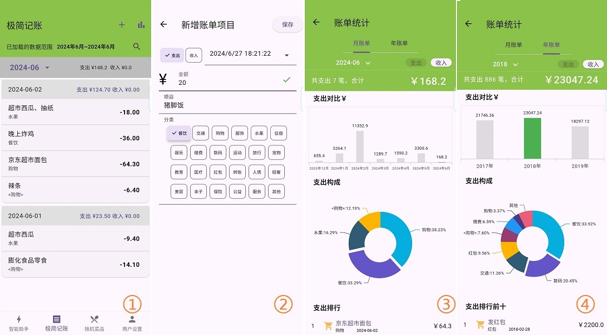

- [SWMate](#swmate)
- [功能介绍](#%E5%8A%9F%E8%83%BD%E4%BB%8B%E7%BB%8D)
  - [AI 智能助手](#ai-%E6%99%BA%E8%83%BD%E5%8A%A9%E6%89%8B)
    - [智能对话](#%E6%99%BA%E8%83%BD%E5%AF%B9%E8%AF%9D)
    - [智能多聊](#%E6%99%BA%E8%83%BD%E5%A4%9A%E8%81%8A)
    - [文档/图片解读](#%E6%96%87%E6%A1%A3%E5%9B%BE%E7%89%87%E8%A7%A3%E8%AF%BB)
    - [文本生图/视频](#%E6%96%87%E6%9C%AC%E7%94%9F%E5%9B%BE%E8%A7%86%E9%A2%91)
    - [创意文字](#%E5%88%9B%E6%84%8F%E6%96%87%E5%AD%97)
    - [图片生图](#%E5%9B%BE%E7%89%87%E7%94%9F%E5%9B%BE)
    - [智能助手补充说明](#%E6%99%BA%E8%83%BD%E5%8A%A9%E6%89%8B%E8%A1%A5%E5%85%85%E8%AF%B4%E6%98%8E)
  - [生活日常工具](#%E7%94%9F%E6%B4%BB%E6%97%A5%E5%B8%B8%E5%B7%A5%E5%85%B7)
    - [极简记账](#%E6%9E%81%E7%AE%80%E8%AE%B0%E8%B4%A6)
    - [随机菜品](#%E9%9A%8F%E6%9C%BA%E8%8F%9C%E5%93%81)
  - [用户设置](#%E7%94%A8%E6%88%B7%E8%AE%BE%E7%BD%AE)
- [其他说明](#%E5%85%B6%E4%BB%96%E8%AF%B4%E6%98%8E)
  - [开发环境](#%E5%BC%80%E5%8F%91%E7%8E%AF%E5%A2%83)
  - [仅 Android](#%E4%BB%85-android)

# SWMate

Smart Work&Life Mate

使用 flutter 开发的一个“智能工作生活类助手”应用。主要包含：

- 以调用各个云平台部署的大模型 API 为基底的“AI 智能助手”，
- 包含极简的记账功能、幸运转盘随机菜品功能的“生活日常工具”。

目前只调试了 Android 部分。

# 功能介绍

## AI 智能助手

目前简单包括了“智能对话”、“智能多聊”、“文档解读”、“图片解读”、“文本生图”、“创意文字”、“图片生图”、“图片生图”、“文生视频”。

_其实就是支持查看几个平台大模型 API 调用效果的 demo，因为有多个平台，所以根据模型类型不同切分出不同的功能模块，而没有聚合在一起，实际上没什么客制化功能。_

目前(2024-09-06)是兼容了**百度、腾讯、阿里、智谱 AI、零一万物、SiliconFlow、讯飞 7 个平台的 92 个大模型(含重复)** 的 API 调用。

### 智能对话

智能对话，就是调用各个平台中的语言大模型 API，进行聊天、问答等。


- ① 可以选择不同的部署模型、提供 API 的云平台
- ② 可以选择指定云平台的指定模型
  1.  选的平台和模型之后，就可以进行问答了
- ③ 可以选定指定的系统角色，完成一些自定义的功能
  - 比如 system role 设定为翻译器，把输入的内容翻译成特定语言
  - 选择好平台和模型之后，再选定指定系统角色，就可以调用预定的功能
  - 系统角色可以自己编写(下详)
- ④ “分段”和“直出”的区别就在于大模型 API 的流式响应和非流式响应
  - 流式响应是 SSE ，可以更快看到 API 响应的结果，也可能随时终止(输入框右边的终止按钮)；
  - 非流式响应就是一次性返回所有数据，等待更久，看到 API 的回复要慢一些


- ① 除了打字文本输入，也支持语音(转换文字)输入
  - 实际实现是先调用讯飞的语音转写，把语音转为了文字，再调用大模型的 API
  - 直接发送语音就直接是转化后的文字，有可能会识别错，可以在 ① 页面中查看转化后的文本，发送文本
- ② 有保存原语音文件在设备本地应用缓存，所以点击可以听原语音
- ③ 每个模型后面有个“信息”图标，可以大致了解该模型的特点
  - 比如需要高级一点的功能，使用 lite 型的模型可能就不合适
- ④ 可以查看最近的对话，点击指定对话历史记录，可以继续交流
  - 历史记录是存在本地的 sqlite 数据库中的
  - 由于保存了完整的 messages，所以点击指定的历史记录，但又切换了其他平台和模型，理论上还是能继续对话。但为了保持一致，切换了平台和模型时，会强制开启新对话。

分段与直出、选择系统角色(下面的文/图生图、文生视频为提示词)图标、模型说明图标、历史记录图标后续模块若存在，功能都类似，则不重复说明。

### 智能多聊

智能多聊在智能对话的基础上，提供了一个问题可以选择多个模型同时回答，便于选择不同模型中你认为最好的回答。

理论上至少选择一个(就和智能对话一样了)，最多可全选(那回答一个问题可能就等很久，手机上划来划去也不好看)


- ① 点击模型选择按钮，可以选定用于对话的模型，至少 1 个
  - 由于多选模型，就不用指定平台了，甚至可以看看不同平台部署的同一个模型的效果
- ② 选择多个模型后，进行问答，可以看到一个用户输入，多个模型回复
- ③ 当选择的模型数量为 2 时，可以固定上下两个滚动区域查看，更加方便逐行对比模型回复效果

和一些模型对战功能类似，不过这个多聊可以选择任何数量。

但各个模型只会记住自己的上下文，不会获得别的模型的输出。

### 文档/图片解读

文档解读和图片解读类似，就是支持用户上传指定格式文档或图片，然后对文档内容和图片内容进行问答。

- 文档解读是我调用了其他工具先把文档提取了“**纯文本**”，再把提取出的文本喂给了语言对话模型，效果可能一般
  - 文档中有图片肯定没有用
  - 文档结构复杂那解析结果肯定不会很好
- 图片解读是直接调用的“vision”视觉模型的 API，效果更纯粹。


- ① 点击“文件上传”图标按钮，选中需要上传的图片或者文件
- ② 如果是文档，点击“文档解析完成”蓝字，可以在底部弹窗查看文档解析后的纯文本(但不支持改动)
  - 如果是图片，可以点击进行预览
- ③④ 对于文档和图片，预设有“翻译”、“总结”、“分析”3 个功能按钮
  - “翻译”和“总结”其实是有写好大模型的 system prompt 参数，直接使用
  - 而“分析”就是正常的对文档和图片继续问答，获取任何想要的回复。
- ⑤ 图片解读可以点击“下载”图标按钮，保存为指定格式文档(txt 或 pdf)
  - 文档解读和图片解读没有保存到数据库的实现，但为了不浪费，每次调用回复完成，都会自动保存
    - 默认文档解读是保存为 txt，图片解读是保存为 pdf
    - 保存为 pdf 主要是为了记录图片
  - 但每次自动保存都会有弹窗提示。如果图片解读不想保存为 pdf，点击“下载”按钮，可以保存为其他格式

### 文本生图/视频

注意，有些模型是同时支持文本生图和参考图生图的，但为了和其他侧重图片生图的模型，是强行分成了 2 个模块。

文本生图和文本生视频结构和操作类似，所以放在一起说


- ① 同样是选择好平台、模型、尺寸、(样式、数量等如果有的话)、提示词等内容，就可以点击“生成图片/视频”按钮，等待生成结果。
  - 对于生成的图片和视频，都可以简单点击预览、长按保存
  - 有些图片和视频只会在对应平台的服务器保存 1 天，需要及时手动保存
- ② 可以点击“预设提示词”查看提示词示例(点击指定预设提示词，会带上正向提示词和反向提示词到输入框)
- ③ 可以查看文本生图/视频的历史记录
  - 像阿里云平台的文生图，是先提交 task，再通过 taskId 获取结果，这样可以在生成过程中不小心取消了还能重新查询结果(历史记录中的“是否完成”栏位)
  - 但 SiliconFlow、智谱 AI 等平台是一次性响应的，没得到生成的图片关闭遮罩了就看不到了。
- ④ 点击指定记录的详情，可以看到当时图片和使用的提示词等信息

### 创意文字

创意文字是阿里云平台的“锦书”模型，支持“字体纹理生成”、“字体变形”、“百家姓生成”。

具体使用和文本生图类似，不再赘述。


### 图片生图

图片生图和文本生图/视频、创意文字也类似，不再赘述。


---

**多模态大模型 API 的一些补充说明**：

1. 文生图这里有 SD，但效果体验下来不如 Flux。
2. 但同样是 FLUX.1-schnell，阿里云平台限免的就支持中文，SiliconFlow 中文效果就差一些了。
3. 讯飞、通义万相、智谱的 CogView 也是收费的文生图，但效果可能也不是很好。
4. 不过目前我找到这些平台，部分多模态模型 API 并不开放给个人开发者，需要企业认证，所以可能有些模型没法使用(比如 SiliconFlow 有限免的 CogVideoX-2b 但我这里用不了)。
   1. 包含语音生成功能的 API 基本都不对个人用户开放(比如豆包)，我对这个需求还是有的
   2. miniMax 好像支持个人开发者的 Voice Generation(Voice Cloning 不行)，但还没想到实际用途

### 智能助手补充说明


- ① 支持自定义管理系统角色，用于语言模型、文生图提示词等
- ④ 点击项次可以查看详细、修改，右上角也可以新增、导入 json 文件。
  - system prompt 写得好，在智能对话中可能有更好的效率。
- ③ 可以调整对话模型中输入输出的文字比例，觉得太小或者太大可以在这个弹窗的 slider 中拖放(等比例缩放)。
- ② 目前是兼容了**百度、腾讯、阿里、智谱 AI、零一万物、SiliconFlow、讯飞 7 个平台的 92 个大模型(含重复)** 的 API 调用，
  - 但打包好的 apk 直接可用的是 5 个平台(除了阿里、零一万物)的 21 个免费的大模型。
    - 作者的密钥
  - 如果想使用全部模型，可自行去各个平台充值、获取密钥，在“平台密钥”页面添加指定栏位
    - **密钥只缓存在本地，事实上，除了调用 API 和加载图片、视频，都没有联网操作**
    - 不必所有平台都充值、申请，想用哪个平台的模型就用填加那个平台的密钥即可。
    - 没有密钥就算加载了全部模型，在功能页面的模型选择框中也不会显示
    - 模型列表可只保留想用的模型，没有充值的平台或者觉得效果差、费用高的模型可以移除，避免误选

---

**特别说明**

- “AI 智能助手”的 8 个功能页面都会先查询是否有可用的模型，没找到可用的就点不进去
- 由于没有后台，这些模型也好、预设角色也好，都在设备本地的 sqlite 里面
  - 如果你找到了 sqlite 数据库，把里面模型的付费栏位改为免费，说不定也就能用作者的密钥了
  - 不过作者也不是所有平台都有充值，可能也只有几块钱来测试接口调用，所以最好还是用自己的密钥
- **代码都是开源的，不必害怕如果用自己的密钥，会泄了露被别人蹭**。
- 为什么不添加 GPT、Claude 等国际领先模型？
  - 首先，贵
  - 其次，官方直连的肯定是不行了，普通使用者还有翻墙的成本
  - 再次，虽然有代理的，但还是贵(实在有需求，后续可以加)

## 生活日常工具

### 极简记账

极度简单的支出流水账记录，虽然名字是记账，但实际上就是一些流水账，然后简单的统计图表。



- 图 1：每天的支出收入信息。
  - 默认是显示当前月份的数据，**上下滚动会切换月份**。
  - 右上角“搜索”按钮，可以对所有的记录进行**关键字搜索**，可以看到相关关键字条目的记录，但不会进行相关统计。
  - **_长按_** 主页的收支记录项次，可以对其进行**删除**。
  - **_双击_** 主页的收支记录项次，可以对其进行**修改**。
- 图 2：点击右上角“加号”按钮，可以**添加**一条新的支出记录。
- 图 3 和图 4：点击右上角“条状图”按钮，可以进入统计图表页面。
  - 目前仅支持简单的按月和按年的柱状图和分类饼图显示。
  - 点击月份和年份下拉按钮，可以切换月份和年份。

### 随机菜品

_这个其实是之前(2024-04-09)就单独开发好的 app 了，功能融合，就直接复制到这里来。_

给不知道每天吃什么的选择困难症患者，指一条参考选项：随机选择一道菜。

如果你关于吃什么，已经习惯了：**随便、不知道、好麻烦、你做主、看运气** 等说法，不妨试一试。

当然，最后是点外卖还是自己做甚至选了依旧不吃，还是看自己的决定。

**1. 使用说明**

如下图：

- 主体是一个转盘，可以选择餐次和重新生成随机菜品。
- 点击转盘即可开始旋转，3 秒后停止，显示结果，旋转时按钮都不可点击。
- 点击选中结果可以跳转到该菜品详情页。
- 如果菜品详情有视频地址，可以打开对应 url；如果菜谱有上传图片(仅支持单张本地图片和使用相机拍照)，可以缩放查看。


- 当然核心还是菜品的数量，默认是文字列表显示，仅仅为了节约流量。
- 点击上方“grid”图标(第一个)可以切换到有预览图的卡片列表，如果图片大注意流量消耗。
- 在列表中点击某一个可以进入详情页(如上)，长按可以删除指定菜品。
- 点击上方“upload”图标(第二个)可以导入菜品 json 文件(格式见下面相关内容，其中图片时本地图片的地址则暂未考虑)。
- 当然，也可以自行一个个手动添加菜品。


**2. 导入的菜品 json 文件格式示例**

```json
[
  {
    "dish_name": "回锅肉",
    "description": "此菜色味俱佳，肉鲜而香，是四川省家喻户晓的传统菜，地方风味很强。",
    "tags": "川菜,家常菜,肉菜,麻辣鲜香",
    "meal_categories": "午餐,晚餐,夜宵",
    "images": [
      "http://www.djy.gov.cn/dyjgb_rmzfwz/uploads/20191014154045sde1q1ajz3d.jpg",
      "https://i3.meishichina.com/atta/recipe/2019/04/18/20190418155556766674398811368081.jpg?x-oss-process=style/p800"
    ],
    "videos": ["https://www.bilibili.com/video/BV1eA4m1L7QY/"],
    "recipe": [
      "原料：\n猪肉500克，蒜苗150克，化猪油40克，盐1克，郫县豆瓣50克，甜酱25克，红白酱油25克，生姜15克，葱20克，花椒10余粒。",
      "作法：\n1. 把带皮的肥瘦相连的猪肉洗干净。",
      "2. 锅内放开水置旺火上，下猪肉和葱、姜、花椒；将熟肉煮熟不煮𤆵；在煮肉过程中撇去汤面浮沫。蒜苗洗净切2.6厘米(约八分)长节。豆瓣剁细。",
      "3. 将捞起的猪肉敞干水汽，在还有余热时切成约0.3厘米(约一分)厚的连皮肉片。",
      "4. 炒锅置中火上，放入猪肉，油烧至五成热时下肉片，同事放微量盐炒均匀；炒至肉片出油时铲在锅边，相继放豆瓣、甜酱在油中炒出香味即与肉共同炒匀，然后放蒜苗合炒；蒜苗炒熟但不要炒蔫，再放酱油炒匀起锅即成。",
      "附 注：\n1.在肉汤中加适量新鲜蔬菜同煮，可增加一样汤菜。",
      "2.根据爱好，菜内可加豆豉炒。",
      "3.如无红酱油可用白糖代替。"
    ],
    "recipe_picture": "https://demo.image.com" // 菜谱只支持单张图片
  },
  { …… }
]
```

在`_dishes/HowToCook`中有整理一些菜品的 json 文件，可用直接导入使用。菜品数据来源于 github 的 [Anduin2017/HowToCook](https://github.com/Anduin2017/HowToCook)。

## 用户设置

目前其实没有用户这个概念，除了调用 API 和一些网络图片，都没有需要联网的东西。

这个模块目前仅有一个"备份恢复"功能。

因为智能助手的对话记录、极简记账的账单条目、随机菜品的菜品列表，都是本地 sqlite 存储的，所以备份就是把 db 中的数据导出成压缩包，恢复就是把压缩包的 json 存入数据库中。

# 其他说明

## 开发环境

在一个 Windows7 中使用 Visual Box 7 安装的 Ubuntu20.04 LTS 虚拟机中使用 VSCode 进行开发。

2024-05-27 使用最新 flutter 版本：

```sh
$ flutter --version
Flutter 3.22.1 • channel stable • https://github.com/flutter/flutter.git
Framework • revision a14f74ff3a (4 天前) • 2024-05-22 11:08:21 -0500
Engine • revision 55eae6864b
Tools • Dart 3.4.1 • DevTools 2.34.3
```

## 仅 Android

**手里没有 IOS 等其他设备，所以相关内容为 0**。

开发机是小米 6(Android 13)，是 16:9 的 1080P 完整屏幕，和目前主流手记的分辨率和长 K 宽比都不一样，几乎肯定在其他的设备有一些显示上的差距，可以反馈或自行修改。

虽然我日常主力机为努比亚 Z60 Ultra(Android 14)，但它和我之前的 Z50 Ultra 一样，[**无法实机开发调试**](https://github.com/flutter/flutter/issues/144999)，所以只有最后打包成 app 后进行使用测试，截图即使用此机器。

安卓平板能跑(在我唯一的平板荣耀平板 5 中安装过)，但很奇怪，主要是字体实际显示效果大小和设计的大小不太一样。
