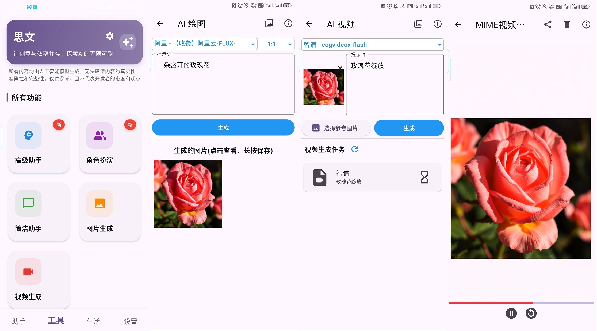
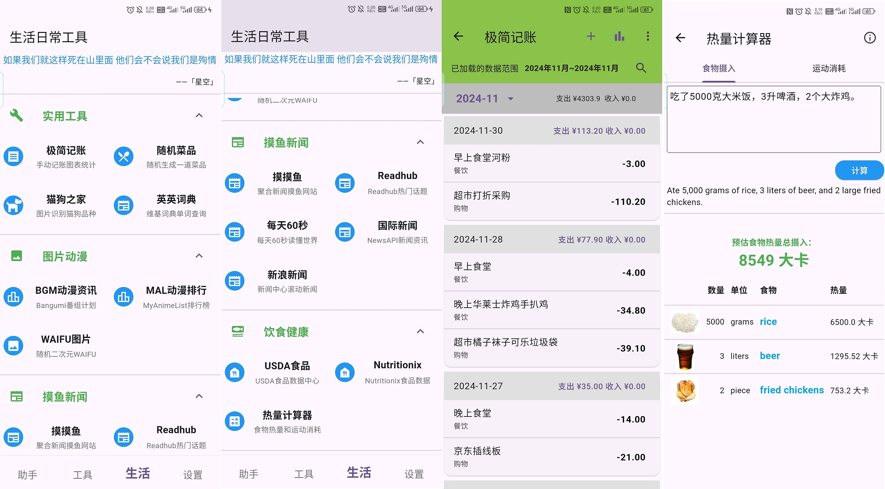

# SWMate

Smart Work&Life Mate

使用 flutter 开发的一个“智能工作生活类助手”应用。主要包含：

- 以简单参数调用各个云平台部署的在线大模型 API 为基底的“**AI 智能助手**”，(简称“工具”)。
  - 2025-03-04 大模型 API 调用**只保留其 HTTP API 兼容 openAI API 结构的**平台和模型，不再兼容其他平台自己定义的 API 结构，具体如下：
  - 对话模型：
    - [阿里](https://help.aliyun.com/zh/model-studio/developer-reference/compatibility-of-openai-with-dashscope)
    - [百度](https://cloud.baidu.com/doc/WENXINWORKSHOP/s/Fm2vrveyu)
    - [腾讯](https://console.cloud.tencent.com/hunyuan/start)
    - [智谱](https://open.bigmodel.cn/dev/api/normal-model/glm-4)
    - [深度求索(DeepSeek)](https://api-docs.deepseek.com/zh-cn/)
    - [零一万物](https://platform.lingyiwanwu.com/docs/api-reference)
    - [无问芯穹](https://docs.infini-ai.com/gen-studio/api/maas.html#/operations/chatCompletions)
    - [硅基流动](https://docs.siliconflow.cn/cn/api-reference/chat-completions/chat-completions)
  - 图片生成：
    - 阿里云: [图像生成-通义万相 文生图 V2 版](https://help.aliyun.com/zh/model-studio/developer-reference/text-to-image-v2-api-reference)、[文生图 FLUX](https://help.aliyun.com/zh/model-studio/developer-reference/flux/)
    - 智谱 AI: [CogView](https://open.bigmodel.cn/dev/api/image-model/cogview)
    - 硅基流动: [创建图片生成请求](https://docs.siliconflow.cn/cn/api-reference/images/images-generations)
  - 视频生成：
    - 阿里云: [视频生成-通义万相](https://help.aliyun.com/zh/model-studio/developer-reference/video-generation-wanx/)
    - 智谱 AI: [CogVideoX](https://open.bigmodel.cn/dev/api/videomodel/cogvideox)
    - 硅基流动: [创建视频生成请求](https://docs.siliconflow.cn/cn/api-reference/videos/videos_submit)
- 包含实用工具、图片动漫、摸鱼新闻、饮食健康等分类的“**生活日常工具**”，(简称“生活”)。
  - 实用工具：极简记账、随机菜品、猫狗之家、英英词典
  - 图片动漫：Bangumi 番组计划、MyAnimeList 排行榜、WAIFU 图片
  - 摸鱼新闻：摸摸鱼、Readhub、每天 60 秒、NewsAPI 国际新闻、新浪中心滚动新闻
  - 饮食健康：美国农业部(USDA)食品数据查询、Nutritionix 食品营养素查询、热量计算器

目前只调试了 Android 手机部分。

_2025-02-17_

当然，如果对 [硅基流动平台](https://siliconflow.cn/zh-cn/models) 感兴趣，还能用下我的邀请码注册，那就更好了，谢谢：

```
https://cloud.siliconflow.cn/i/tRIcST68
```

该平台有很多不同的大模型 API 可以调用，比如最新的 DeepSeek、Qwen、Llama、stable-diffusion 等。
很多轻量级的模型可以免费使用，一些小需求可以节约时间，不必频繁切换。

# 更新说明

查看 [CHANGELOG](CHANGELOG.md)，**新版本改动的模块和功能信息也在该 ChangeLog 中简述**。

# 功能介绍

## AI 智能助手

目前简单包括了 AI 助手、AI 绘图、AI 视频。

- APP 启动首页就是 AI 助手，可以进行常规的聊天、问答、图像识别对话等。
- 可以切换底部导航栏的“工具”标签，使用 AI 绘图、AI 视频等。

### AI 助手

AI 助手，就是调用各个平台中的语言大模型 API，进行聊天、问答等；可以切换大模型类别(文本对话、图片理解等)使用特定功能。


- 选定使用对话模型类别 -> 选定指定平台部署的指定模型，输入框输入内容，点击“发送”图标，开始聊天
- 除了打字文本输入，也支持语音(转换文字)输入 _(这个组件后续有时间再优化一下)_
  - 实际实现是先调用讯飞的语音转写 API，把语音转为了文字，再调用大模型的 API
  - 直接发送语音就直接是转化后的文字，有可能会识别错，可以在页面中查看转化后的文本，发送文本
  - 有保存原语音文件在设备本地应用缓存，所以点击可以听原语音
- 可以查看最近的对话（点击对话主页面右上角的历史记录图标），点击指定对话历史记录，可以继续交流
  - 历史记录是存在设备本地的 sqlite 数据库中的
- 如果平台有 DeepSeek R 系列深度思考(默认的)功能，返回中有`reasoning_content`字段，会显示在对话框中当作思考内容。

### AI 绘图/视频



从“工具”页面进入的“AI 助手”，和首页直接显示的唯一区别，就是没有底部导航栏。

AI 绘图/视频结构和操作类似，所以放在一起说。

- 同样是选择好平台部署的模型、尺寸，输入提示词后，点击“生成”按钮，等待生成结果。
  - 部分模型可以选择参考图
  - 文生图大部分是直接返回图片 url，所以在未返回前请勿退出
  - 视频生成是先提交 task，再通过 taskId 获取结果。task 状态会保存在数据库，可以手动刷新查看生成进度
    - 视频生成任务记录长按可删除，但已保存到设备的视频，删除任务时不会删除。
  - 对于生成的图片和视频，默认会保存在本地(因为返回的 url 时效都比较短)
- 可以查看 AI 绘图/视频的历史资源
  - AI 绘图/视频生成成功之后，会默认保存在设备指定路径，点击右上角媒体资源图标，即可进入资源管理页面
  - 资源管理页面中，可以对资源进行简单预览、分享、删除等操作

---

### 补充说明


在对话主页面中，右上角有个调整对话消息文本字体大小的按钮，点击之后在弹窗的 slider 中拖动调整。

打包好的 apk 是直接使用我个人密钥的一些免费的大模型，都是比较基础的。可以自行导入平台模型和密钥使用自己的资源。

- “导入”入口在“工具”模块右上角，点击“导入导出”图标，进入配置页面。
- 如果想使用本应用支持的平台中更加强劲的模型，可自行去各个平台充值、获取密钥，再导入密钥和模型 json 文件
  - **密钥只缓存在本地，事实上，除了调用 API 和加载图片、视频，都没有联网操作**
  - 想用哪个平台、哪个模型，全都自己导入
- 平台密钥和模型规格的**固定 json 结构**见下方

---

**_注意，平台密钥和平台模型规格要同时导入，否则无法正常使用。_**

#### 平台密钥 json 结构

导入平台的密钥的 key 一定要和这个文件中 key 一样，不然匹配不上：

```json
{
  "USER_ALIYUN_API_KEY": "sk-xxx",
  "USER_BAIDU_API_KEY_V2": "xxx",
  "USER_TENCENT_API_KEY": "xxx",

  "USER_DEEPSEEK_API_KEY": "sk-xxx",
  "USER_LINGYIWANWU_API_KEY": "xxx",
  "USER_ZHIPU_API_KEY": "xxx",

  "USER_SILICON_CLOUD_API_KEY": "sk-xxx",
  "USER_INFINI_GEN_STUDIO_API_KEY": "sk-xxx",

  // 讯飞, 语音转写需要
  "USER_XFYUN_APP_ID": "xxx",
  "USER_XFYUN_API_KEY": "xxx",
  "USER_XFYUN_API_SECRET": "xxx",

  // 生活工具中 NUTRITIONIX 食品数据查询需要
  "USER_NUTRITIONIX_APP_ID": "xxx",
  "USER_NUTRITIONIX_APP_KEY": "xxx",

  // newsapi新闻需要
  "USER_NEWS_API_KEY": "xxx"
}
```

- 密钥可以不是所有平台都填，但填写的部分 key 一定要完全一致，否则识别不到就算有导入模型也用不了
- 讯飞那几个是语音转写需要，NUTRITIONIX 是生活工具中 Nutritionix 平台的食品数据查询需要，现在默认是使用我的账号，没余额了估计就不能用了。

#### 大模型规格 json 结构

```json
[
  {
    "platform": "lingyiwanwu",
    "model": "yi-lightning",
    "modelType": "cc",
    "name": "yi-lightning",
    "contextLength": 16000,
    "isFree": false,
    "inputPrice": 0.99,
    "outputPrice": 0.99,
    "gmtRelease": "2024-12-23"
  },
  {
    "platform": "siliconCloud",
    "model": "Pro/black-forest-labs/FLUX.1-schnell",
    "modelType": "tti",
    "name": "Pro/FLUX.1-schnell",
    "isFree": false,
    "costPer": 0.05,
    "gmtRelease": "2024-08-01"
  },
  {
    "platform": "<*代码中自定义的平台代号，枚举值>",
    "model": "<*指定平台中使用的模型代号，必须与API文档中一致，会用于构建http请求>",
    "modelType": "<*代码中自定义的模型类型代号，枚举值>",
    "name": "<模型名称，用于显示，随意，可识别出即可>",
    "contextLength": "<上下文长度>",
    "isFree": false, // 是否免费
    "inputPrice": 6, // 输入价格(对话模型)
    "outputPrice": 6, // 输出价格(对话模型)
    "costPer": 0.05, // 单次调用价格(绘图/视频模型)
    "gmtRelease": "<平台中模型发布时间>"
  }
  // ……
]
```

- platform 枚举值:

```ts
enum ApiPlatform {
  aliyun, // 阿里云百炼
  baidu, // 百度千帆
  tencent, // 腾讯混元

  deepseek, // 深度求索
  lingyiwanwu, // 零一万物
  zhipu, // 智谱 AI

  siliconCloud, // 硅基流动
  infini, // 无问芯穹的 genStudio
}
```

- modelType 枚举值:

```ts
enum LLModelType {
  cc, // 文本对话
  vision, // 图片解读
  tti, // 文本生图
  iti, // 图片生图
  image, // 图片生成(文生图生通用)
  ttv, // 文生视频
  itv, // 图生视频
  video, // 视频生成(文生图生通用)
}
```

后续我会放一些整理好的各个平台我常用的大模型规格 json 文件在项目的 **[\_cus_model_jsons](./_cus_model_jsons)** 文件夹中，可以参考使用。

### TODO

2025-03-04 时想到的：

- [ ] AI 工具部分:
  - [ ] 高级请求参数配置(temperature、max_tokens 等比较常用但暂没支持用户配置)
  - [ ] 测试低成本让少量模型可联网搜索
  - [ ] 对话消息展示的 Markdown 格式结合 LaTeX
  - [ ] AI 助手可编辑某个输入对话的消息，并记录对话分支
  - [ ] 添加角色卡功能，可少量预设，支持用户自行导入
  - [ ] 一键保存整个对话为 Markdown 文件？
  - [ ] 多 Agent 的群聊、角色扮演？
  - [ ] 免费云端数据库用于数据存储？
  - [ ] 是否简单使用 Nodejs 编写一个后端？
- [ ] 生活工具部分:
  - [ ] 一个简单的文本记事本(ToDo)?

## 生活日常工具



生活工具模块有很多实用小工具，大部分是我个人感兴趣或者能找到免费 API 服务的东西。

### 极简记账

极度简单的支出流水账记录，虽然名字是记账，但实际上就是一些流水账，然后简单的统计图表。


- 图 1：每天的支出收入信息。
  - 默认是显示当前月份的数据，**上下滚动会切换月份**。
  - 右上角“搜索”按钮，可以对所有的记录进行**关键字搜索**，可以看到相关关键字条目的记录，但不会进行相关统计。
  - **_长按_** 主页的收支记录项次，可以对其进行**删除**。
  - **_双击_** 主页的收支记录项次，可以对其进行**修改**。
- 图 2：点击右上角“加号”按钮，可以**添加**一条新的支出记录。
- 图 3 和图 4：点击右上角“条状图”按钮，可以进入统计图表页面。
  - 目前仅支持简单的按月和按年的柱状图和分类饼图显示。
  - 点击月份和年份下拉按钮，可以切换月份和年份。

### 随机菜品

_这个其实是之前(2024-04-09)就单独开发好的 app 了，功能融合，就直接复制到这里来。_

给不知道每天吃什么的选择困难症患者，指一条参考选项：随机选择一道菜。

如果你关于吃什么，已经习惯了：**随便、不知道、好麻烦、你做主、看运气** 等说法，不妨试一试。

当然，最后是点外卖还是自己做甚至选了依旧不吃，还是看自己的决定。

**1. 使用说明**

如下图：

- 主体是一个转盘，可以选择餐次和重新生成随机菜品。
- 点击转盘即可开始旋转，3 秒后停止，显示结果，旋转时按钮都不可点击。
- 点击选中结果可以跳转到该菜品详情页。
- 如果菜品详情有视频地址，可以打开对应 url；如果菜谱有上传图片(仅支持单张本地图片和使用相机拍照)，可以缩放查看。


- 当然核心还是菜品的数量，默认是文字列表显示，仅仅为了节约流量。
- 点击上方“grid”图标(第一个)可以切换到有预览图的卡片列表，如果图片大注意流量消耗。
- 在列表中点击某一个可以进入详情页(如上)，长按可以删除指定菜品。
- 点击上方“upload”图标(第二个)可以导入菜品 json 文件(格式见下面相关内容，其中图片时本地图片的地址则暂未考虑)。
- 当然，也可以自行一个个手动添加菜品。


**2. 导入的菜品 json 文件格式示例**

```json
[
  {
    "dish_name": "回锅肉",
    "description": "此菜色味俱佳，肉鲜而香，是四川省家喻户晓的传统菜，地方风味很强。",
    "tags": "川菜,家常菜,肉菜,麻辣鲜香",
    "meal_categories": "午餐,晚餐,夜宵",
    "images": [
      "http://www.djy.gov.cn/dyjgb_rmzfwz/uploads/20191014154045sde1q1ajz3d.jpg",
      "https://i3.meishichina.com/atta/recipe/2019/04/18/20190418155556766674398811368081.jpg?x-oss-process=style/p800"
    ],
    "videos": ["https://www.bilibili.com/video/BV1eA4m1L7QY/"],
    "recipe": [
      "原料：\n猪肉500克，蒜苗150克，化猪油40克，盐1克，郫县豆瓣50克，甜酱25克，红白酱油25克，生姜15克，葱20克，花椒10余粒。",
      "作法：\n1. 把带皮的肥瘦相连的猪肉洗干净。",
      "2. 锅内放开水置旺火上，下猪肉和葱、姜、花椒；将熟肉煮熟不煮𤆵；在煮肉过程中撇去汤面浮沫。蒜苗洗净切2.6厘米(约八分)长节。豆瓣剁细。",
      "3. 将捞起的猪肉敞干水汽，在还有余热时切成约0.3厘米(约一分)厚的连皮肉片。",
      "4. 炒锅置中火上，放入猪肉，油烧至五成热时下肉片，同事放微量盐炒均匀；炒至肉片出油时铲在锅边，相继放豆瓣、甜酱在油中炒出香味即与肉共同炒匀，然后放蒜苗合炒；蒜苗炒熟但不要炒蔫，再放酱油炒匀起锅即成。",
      "附 注：\n1.在肉汤中加适量新鲜蔬菜同煮，可增加一样汤菜。",
      "2.根据爱好，菜内可加豆豉炒。",
      "3.如无红酱油可用白糖代替。"
    ],
    "recipe_picture": "https://demo.image.com" // 菜谱只支持单张图片
  },
  { …… }
]
```

在`_dishes/HowToCook`中有整理一些菜品的 json 文件，可用直接导入使用。菜品数据来源于 github 的 [Anduin2017/HowToCook](https://github.com/Anduin2017/HowToCook)。

### 其他生活助手功能

查看 [CHANGELOG](CHANGELOG.md) 查看更多。

## 用户设置

目前其实没有用户这个概念，除了调用 API 和一些网络图片，都没有需要联网的东西。

这个模块目前仅有一个"备份恢复"功能。

因为智能助手的对话记录、极简记账的账单条目、随机菜品的菜品列表等，都是本地 sqlite 存储的，所以备份就是把 db 中的数据导出成 json 文件并压缩，恢复就是把压缩包的 json 存入数据库中。

**注意**：

- 恢复会清空当前数据库中的数据，请谨慎操作。
  - 更新或卸载前，推荐先全量备份。
- 0.4.0 之前的版本数据库表结构和现在不一样，所以不能恢复。

# 其他说明

## 开发环境

在一个 Windows 7 中使用 Visual Box 7 安装的 Ubuntu20.04 LTS 虚拟机中使用 VSCode 进行开发。

2024-11-04 使用最新 flutter 版本：

```sh
$ flutter --version
Flutter 3.24.4 • channel stable • https://github.com/flutter/flutter.git
Framework • revision 603104015d (11 天前) • 2024-10-24 08:01:25 -0700
Engine • revision db49896cf2
Tools • Dart 3.5.4 • DevTools 2.37.3
```

2024-05-27 使用最新 flutter 版本：

```sh
$ flutter --version
Flutter 3.22.1 • channel stable • https://github.com/flutter/flutter.git
Framework • revision a14f74ff3a (4 天前) • 2024-05-22 11:08:21 -0500
Engine • revision 55eae6864b
Tools • Dart 3.4.1 • DevTools 2.34.3
```

## 仅 Android

**手里没有 IOS 等其他设备，所以相关内容为 0**。

开发机是小米 6(Android 13)，是 16:9 的 1080P 完整屏幕，和目前主流手记的分辨率和长 K 宽比都不一样，几乎肯定在其他的设备有一些显示上的差距，可以反馈或自行修改。

虽然我日常主力机为努比亚 Z60 Ultra(Android 14)，但它和我之前的 Z50 Ultra 一样，[**无法实机开发调试**](https://github.com/flutter/flutter/issues/144999)，所以只有最后打包成 app 后进行使用测试，截图即使用此机器。

安卓平板能跑(在我唯一的平板荣耀平板 5 中安装过)。
